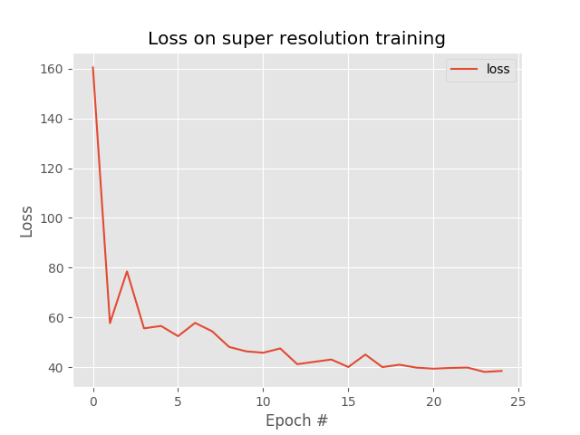

# SuperResolution
Making low resolution images to high resolution

## Paper
Image Super-Resolution Using Deep Convolutional Networks (https://arxiv.org/pdf/1501.00092.pdf)

## Dataset
ukbench dataset (https://archive.org/download/ukbench)
Randomnly selected around 100 images from complete 10200 images of ukbench dataset. Placed all the image files in path - dataset/ukbench100/

## Building Dataset in hdf5 format
Here we use only convolutions and all the convolution filters are used to find the patterns of high resolution sharp images with dimesions of 33x33 and stride with 14. Each image can have many 33x33 smaller dimension scales and this might cause delay, perfomance delay if we use images directly and also can ran into another major problem i.e., ran out of memory. To over come these problem we can create hdf5 datasets or .rec files using mxnet. For now we use hdf5 dataset. Files in inputoutput/ folder are used to dataset writer and generator.
By excuting build_dataset.py we can create hdf5 dataset in dataset/output/ folder with file names inputs.hdf5 & outputs.hdf5. For more details go through paper. 
Please find the screen shot of hdf5 files which will be in GB.

## Training 
To train the model, execute train.py. Please find the training loss plot below for 25 epocs which ran on gpu. Please don't try on CPU, it takes hours to complete just for 100 images.

## Model outputs
### input image 

### baseline image (Please go through paper for clear understanding) & output image

